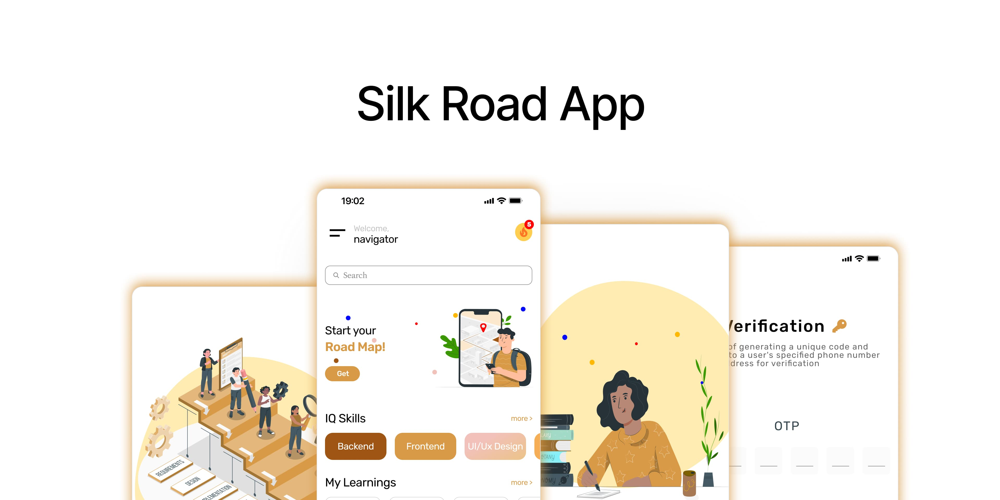

<!DOCTYPE html>
<html lang="en">
<head>
  <meta charset="UTF-8">
  <meta name="viewport" content="width=device-width, initial-scale=1.0">
  <title>Silk Road</title>
  <link rel="stylesheet" href="styles.css">
  <style>
    body {
      margin: 0;
      display: flex;
      justify-content: center;
      align-items: center;
      height: 100vh;
      background-color: #f4f4f4;
    }
    img {
      max-width: 100%;
      height: auto;
      box-shadow: 0 4px 8px rgba(0, 0, 0, 0.2);
    }
  </style>
</head>
<body>
  
</body>
</html>

**Silk Road** is an innovative AI-driven mobile application tailored for developers and software engineers, offering personalized learning paths that enhance skill development. Our robust backend API, meticulously crafted with Node.js and Express.js, delivers essential endpoints that empower features including user authentication, career track recommendations, and tailored skill assessments, ensuring a seamless and enriching user experience.



## Published API Link

Our API is live and fully operational. You can access it here:

[**Silk Road APIs**](https://silkroadapis-production.up.railway.app/)

Explore the available endpoints and integrate them seamlessly into your application. We encourage you to leverage the capabilities of our API for enhanced functionality and user experience.

## Features

- **Authentication**:

  - **User Registration**: Implement a secure signup process utilizing JWT for robust authentication.
  - **User Login**: Streamlined login experience with token generation to manage user sessions efficiently.
  - **Password Recovery**:
    - Initiate password resets via email, enhancing user security.
    - OTP verification process to confirm identity before resetting passwords.

- **User Management**:

  - Comprehensive CRUD operations for effective user account management.
  - **User-Centric Operations**:
    - **Retrieve Profile**: Access detailed information of the logged-in user.
    - **Profile Update**: Modify personal details, including name and email, with validation.
    - **Password Update**: Change the user's password securely with real-time validation checks.
    - **Account Deactivation**: Provide users with the option to deactivate their accounts, promoting user autonomy.

- **Photo Uploads**:

  - Seamless integration for uploading and managing profile images through Cloudinary.
  - Automatic image optimization ensures fast load times without compromising quality.
  - Secure storage and retrieval mechanisms guarantee user images are protected and readily accessible.
  - Dynamic profile picture updates foster a personalized user experience.

- **Mentorship Management**:

  - Robust CRUD operations for managing mentor appointments, facilitating productive interactions between users and mentors.

- **Shopping Cart Functionality**:

  - Intuitive management of items in the cart, allowing users to add, remove, and view course modules effortlessly.

- **Order Management**:

  - Secure ordering process for course enrollment, powered by Stripe for reliable payment processing.

- **Real-Time Communication**:

  - Engage in dynamic discussions through real-time chat channels, supported by Socket.io, with dedicated messaging models for effective communication.

- **Module and Track Structure**:

  - Organize programming tracks into comprehensive modules, providing a structured learning experience tailored to individual user needs.

- **Gamification Elements**:
  - **Achievements and Streaks**: Users earn badges for completing challenges, fostering motivation and a sense of accomplishment.
  - Daily challenges enhance user engagement and learning progression, promoting consistent interaction with the platform.

## Technologies Used

- **Node.js**: JavaScript runtime environment.
- **Express.js**: Fast, unopinionated, minimalist web framework for Node.js.
- **MongoDB**: NoSQL database for data storage.
- **Cloudinary**: Cloud storage service for handling file uploads.
- **Multer**: Middleware for handling `multipart/form-data` for file uploads.
- **Nodemailer**: Library for sending emails, used in user verification and password recovery.
- **bcryptjs**: A library for hashing passwords securely.
- **dotenv**: Loads environment variables from a `.env` file into `process.env`.
- **express-async-handler**: Simplifies async error handling in Express routes.
- **express-validator**: Middleware for validating and sanitizing user input.
- **jsonwebtoken**: Used for creating and verifying JSON Web Tokens (JWTs).
- **mongoose**: MongoDB object modeling tool designed to work in an asynchronous environment.
- **body-parser**: Middleware to parse incoming request bodies in a middleware before your handlers.
- **compression**: Middleware to compress response bodies for better performance.
- **cross-env**: Allows setting environment variables across platforms.
- **express-mongo-sanitize**: Middleware to prevent MongoDB Operator Injection.
- **express-rate-limit**: Middleware for basic rate-limiting for Express apps.
- **hpp**: Middleware to protect against HTTP parameter pollution.
- **socket.io**: Enables real-time, bidirectional communication between clients and servers.
- **socket.io-client**: Client-side counterpart for real-time communication with Socket.io.
- **stripe**: Library for integrating Stripe payment processing into your app.
  Here’s how you can integrate **Helmet** into the list of packages you're mentioning:
- **Helmet**: A middleware for setting various HTTP headers to enhance the security of your application against common web vulnerabilities.

## Dev Dependencies

- **jest**: JavaScript testing framework for unit testing.
- **supertest**: A library for testing Node.js HTTP servers.
- **colors**: Library for adding color to console outputs.
- **morgan**: HTTP request logger middleware for Node.js.

## Getting Started

### Prerequisites

Make sure you have the following installed and configured:

- [Node.js](https://nodejs.org/) (version 14.x or later is recommended)
- [MongoDB](https://www.mongodb.com/) (local or cloud setup like MongoDB Atlas)
- [Cloudinary Account](https://cloudinary.com/) (for file storage; ensure you have your Cloudinary `CLOUDINARY_CLOUD_NAME`, `CLOUDINARY_API_KEY`, and `CLOUDINARY_SECRET_KEY` set in your `.env` file)
- [Stripe Account](https://stripe.com/) (for payment integration; ensure you have your `STRIPE_SECRET_KEY` set in your `.env` file)

### Installation

1. Clone the repository:

```bash
git clone https://github.com/SilckRoad-MarcoPolo/silkRoad_APIs.git
```

2. Navigate to the project directory:

```bash
cd silkroad_apis
```

3. Install dependencies:

```bash
npm install
```

4. Set up environment variables by creating a `.env` file in the root directory:

```bash
# Node Environment
NODE_ENV=production

# Port
PORT=3000

# Database
DB_URL=<YOUR_MONGODB_URI>

# JWT
JWT_SECRET=<YOUR_JWT_SECRET>
JWT_EXPIRES_IN=30d

# Email
EMAIL_HOST=<YOUR_SMTP_HOST>
EMAIL_PORT=<YOUR_SMTP_PORT>
EMAIL_USER=<YOUR_EMAIL_USER>
EMAIL_PASSWORD=<YOUR_EMAIL_PASSWORD>

# Cloudinary
CLOUDINARY_CLOUD_NAME=<YOUR_CLOUDINARY_CLOUD_NAME>
CLOUDINARY_API_KEY=<YOUR_CLOUDINARY_API_KEY>
CLOUDINARY_SECRET_KEY=<YOUR_CLOUDINARY_SECRET_KEY>

# Stripe
STRIPE_SECRET_KEY=<YOUR_STRIPE_SECRET_KEY>
STRIPE_WEBHOOK_SECRET=<YOUR_STRIPE_WEBHOOK_SECRET>

# Admin Token for testing
ADMIN_TOKEN=<YOUR_ADMIN_TOKEN>

```

5. Scripts

### Development

To start the development server with **nodemon** for automatic restarts:

```bash
npm run start:dev
```

### Production

To start the production server:

```bash
npm run start:prod
```

## Security

Security is a top priority in this project. The following measures have been implemented to protect user data and application integrity:

1. **Environment Variables**: Sensitive information such as API keys and database credentials are stored in environment variables, ensuring they are not exposed in the source code.

2. **Input Validation**: All user inputs are validated and sanitized using `express-validator` to prevent injection attacks.

3. **Rate Limiting**: The `express-rate-limit` middleware is used to protect against brute force attacks by limiting the number of requests from a single IP address.

4. **Helmet Middleware**: Security headers are set using the `helmet` middleware to enhance security against common vulnerabilities.

5. **Data Sanitization**:

   - **MongoDB Sanitization**: The `express-mongo-sanitize` middleware is used to prevent NoSQL injection attacks by sanitizing user inputs.
   - **HTTP Parameter Pollution Protection**: The `hpp` middleware protects against HTTP parameter pollution attacks, ensuring that malicious parameters do not compromise application logic.

6. **Compression**: The `compression` middleware is utilized to enable Gzip compression, reducing the size of response bodies and improving performance while maintaining security.

7. **Error Handling**: Comprehensive error handling mechanisms are in place to prevent the leakage of sensitive information in error responses.

8. **JWT Authentication**: JSON Web Tokens are used for secure user authentication, ensuring that only authorized users can access protected routes.

By adhering to these security practices, the application aims to provide a safe and secure environment for users.

## API Routes

### Base URLs

- **Development**: `http://localhost:3000`
- **Production**: `https://silkroadapis-production.up.railway.app`

### Public Routes

- **POST /api/v1/auth/signup**  
  Registers a new user.  
  **Validators**: `authValidator.signUpValidator`  
  **Controller**: `signup`

- **POST /api/v1/auth/login**  
  Logs in an existing user.  
  **Validators**: `authValidator.logInValidator`  
  **Controller**: `login`

- **POST /api/v1/auth/forgotpassword**  
  Initiates a password reset request.  
  **Validators**: `authValidator.forgotPasswordValidator`  
  **Controller**: `forgotPassword`

- **POST /api/v1/auth/verifyOTP**  
  Verifies the OTP sent for password recovery.  
  **Controller**: `verifyPasswordCode`

- **PUT /api/v1/auth/resetpassword**  
  Resets the user's password after OTP verification.  
  **Controller**: `resetPassword`

### Protected Routes (Require Authentication)

- **POST /api/v1/upload-photo**  
  Uploads a user avatar or photo.  
  **Middleware**: `protect`, `upload.single("photo")`  
  **Controller**: `uploadPhoto`

- **PATCH /api/v1/users/updatepassword**  
  Updates the logged-in user's password.  
  **Middleware**: `protect`, `userValidators.updatePasswordValidator`  
  **Controller**: `userController.updatePassword`

- **PATCH /api/v1/users/updateprofile**  
  Updates the user's profile information.  
  **Middleware**: `protect`, `userValidators.updateUserValidator`  
  **Controller**: `userController.updateProfile`

- **DELETE /api/v1/users/inactiveaccount**  
  Deactivates the user's account.  
  **Middleware**: `protect`  
  **Controller**: `userController.inactiveAccount`

### Admin Routes (Require Admin Access)

- **GET /api/v1/users**  
  Retrieves all users.  
  **Middleware**: `protect`, `restrictTo("admin")`  
  **Controller**: `userController.getUsers`

- **POST /api/v1/users**  
  Creates a new user.  
  **Middleware**: `protect`, `restrictTo("admin")`, `userValidators.createUserValidator`  
  **Controller**: `userController.createUser`

- **GET /api/v1/users/:id**  
  Retrieves a specific user by ID.  
  **Middleware**: `protect`, `restrictTo("admin")`, `userValidators.checkIDValidator`  
  **Controller**: `userController.getUser`

- **PATCH /api/v1/users/:id**  
  Updates a specific user by ID.  
  **Middleware**: `protect`, `restrictTo("admin")`, `userValidators.checkIDValidator`  
  **Controller**: `userController.updateUser`

- **DELETE /api/v1/users/:id**  
  Deletes a specific user by ID.  
  **Middleware**: `protect`, `restrictTo("admin")`, `userValidators.checkIDValidator`  
  **Controller**: `userController.deleteUser`

### Mentor Routes (Require Mentor Access)

- **GET /api/v1/appointments**  
  Retrieves all appointments for the logged-in mentor.  
  **Middleware**: `protect`, `restrictTo("mentor")`  
  **Controller**: `appointmentController.getAppointments`

- **POST /api/v1/appointments**  
  Creates a new appointment.  
  **Middleware**: `protect`, `restrictTo("mentor")`, `createAndUpdateAppointmentValidator`  
  **Controller**: `appointmentController.createAppointment`

- **GET /api/v1/appointments/:id**  
  Retrieves a specific appointment by ID.  
  **Middleware**: `protect`, `restrictTo("mentor")`, `checkAppointmentId`  
  **Controller**: `appointmentController.getAppointment`

- **PATCH /api/v1/appointments/:id**  
  Updates a specific appointment by ID.  
  **Middleware**: `protect`, `restrictTo("mentor")`, `createAndUpdateAppointmentValidator`  
  **Controller**: `appointmentController.updateAppointment`

- **DELETE /api/v1/appointments/:id**  
  Deletes a specific appointment by ID.  
  **Middleware**: `protect`, `restrictTo("mentor")`, `checkAppointmentId`  
  **Controller**: `appointmentController.deleteAppointment`

### Cart Routes

- **POST /api/v1/cart**  
  Adds an item to the cart.  
  **Middleware**: `protect`  
  **Controller**: `cartControllers.addToCart`

- **GET /api/v1/cart**  
  Retrieves the user's cart items.  
  **Middleware**: `protect`  
  **Controller**: `cartControllers.getCart`

- **DELETE /api/v1/cart**  
  Removes an item from the cart.  
  **Middleware**: `protect`  
  **Controller**: `cartControllers.removeFromCart`

### Order Routes

- **POST /api/v1/orders**  
  Creates a new order for course modules.  
  **Middleware**: `protect`  
  **Controller**: `orderControllers.createOrder`

- **GET /api/v1/orders**  
  Retrieves the logged-in user's orders.  
  **Middleware**: `protect`  
  **Controller**: `orderControllers.getMyOrders`

- **GET /api/v1/orders/checkout-session/:id**  
  Retrieves the checkout session for the order.  
  **Middleware**: `protect`  
  **Controller**: `orderControllers.getCheckoutSession`

- **PUT /api/v1/orders/:id/pay**  
  Marks the order as paid.  
  **Middleware**: `protect`  
  **Controller**: `orderControllers.markOrderAsPaid`

- **GET /api/v1/orders/:id**  
  Retrieves a specific order by ID.  
  **Middleware**: `protect`  
  **Controller**: `orderControllers.getMyOrderById`

- **POST /orders/webhook-checkout**  
  Route to handle Stripe checkout webhooks.  
  Body: Raw JSON  
  Controller: `orderController.stripeWebhook`

### Chat Routes

- **POST /api/v1/chat/channels**  
  Creates a new chat channel.  
  **Middleware**: `protect`, `createChannelValidators`  
  **Controller**: `createChannel`

- **GET /api/v1/chat/channels**  
  Retrieves all chat channels.  
  **Middleware**: `protect`  
  **Controller**: `getChannels`

- **POST /api/v1/chat/messages**  
  Sends a message in a channel.  
  **Middleware**: `protect`, `sendMessageValidators`  
  **Controller**: `sendMessage`

- **GET /api/v1/chat/messages/:channelId**  
  Retrieves messages for a specific channel.  
  **Middleware**: `protect`  
  **Controller**: `getMessages`

### Module Routes

- **GET /api/v1/modules**  
  Retrieves all modules.  
  **Middleware**: `protect`, `restrictTo("admin")`  
  **Controller**: `moduleController.getModules`

- **POST /api/v1/modules**  
  Creates a new module.  
  **Middleware**: `protect`, `restrictTo("admin")`, `createAndUpdateModuleValidator`  
  **Controller**: `moduleController.createModule`

- **GET /api/v1/modules/:id**  
  Retrieves a specific module by ID.  
  **Middleware**: `checkModuleId`  
  **Controller**: `moduleController.getModule`

- **PATCH /api/v1/modules/:id**  
  Updates a specific module by ID.  
  **Middleware**: `protect`, `restrictTo("admin")`, `createAndUpdateModuleValidator`  
  **Controller**: `moduleController.updateModule`

- **DELETE /api/v1/modules/:id**  
  Deletes a specific module by ID.  
  **Middleware**: `protect`, `restrictTo("admin")`, `checkModuleId`  
  **Controller**: `moduleController.deleteModule`

### Daily Challenge Routes

- **GET /api/v1/daily-challenges**  
  Retrieves daily challenges.  
  **Controller**: `dailyChallengeController.getDailyChallenges`

- **POST /api/v1/daily-challenges**  
  Creates a new daily challenge.  
  **Middleware**: `protect`, `restrictTo("admin")`, `createAndUpdateDailyChallengeValidators`  
  **Controller**: `dailyChallengeController.createDailyChallenge`

- **GET /api/v1/daily-challenges/:id**  
  Retrieves a specific daily challenge by ID.  
  **Middleware**: `checkDailyChallengeId`  
  **Controller**: `dailyChallengeController.getDailyChallenge`

- **PATCH /api/v1/daily-challenges/:id**  
  Updates a specific daily challenge by ID.  
  **Middleware**: `protect`, `restrictTo("admin")`, `checkDailyChallengeId`, `createAndUpdateDailyChallengeValidators`  
  **Controller**: `dailyChallengeController.updateDailyChallenge`

- **DELETE /api/v1/daily-challenges/:id**  
  Deletes a specific daily challenge by ID.  
  **Middleware**: `protect`, `restrictTo("admin")`, `checkDailyChallengeId`  
  **Controller**: `dailyChallengeController.deleteDailyChallenge`

### Badge Routes

- **GET /api/v1/badges**  
  Retrieves all badges.  
  **Controller**: `badgeController.getBadges`

- **POST /api/v1/badges**  
  Creates a new badge.  
  **Middleware**: `protect`, `restrictTo("admin")`,

`createAndUpdateBadgeValidators`  
 **Controller**: `badgeController.createBadge`

- **GET /api/v1/badges/:id**  
  Retrieves a specific badge by ID.  
  **Middleware**: `checkBadgeId`  
  **Controller**: `badgeController.getBadge`

- **PATCH /api/v1/badges/:id**  
  Updates a specific badge by ID.  
  **Middleware**: `protect`, `restrictTo("admin")`, `checkBadgeId`, `createAndUpdateBadgeValidators`  
  **Controller**: `badgeController.updateBadge`

- **DELETE /api/v1/badges/:id**  
  Deletes a specific badge by ID.  
  **Middleware**: `protect`, `restrictTo("admin")`, `checkBadgeId`  
  **Controller**: `badgeController.deleteBadge`

### Streak Routes

- **GET /api/v1/streaks**  
  Retrieves all XP and streaks.  
  **Controller**: `streacksController.getXpAndStreaks`

- **POST /api/v1/streaks**  
  Creates a new XP and streak.  
  **Middleware**: `protect`, `restrictTo("admin")`, `createAndUpdateStreakValidator`  
  **Controller**: `streacksController.createXpAndStreak`

- **GET /api/v1/streaks/:id**  
  Retrieves a specific streak by ID.  
  **Middleware**: `checkStreakId`  
  **Controller**: `streacksController.getXpAndStreak`

- **PATCH /api/v1/streaks/:id**  
  Updates a specific streak by ID.  
  **Middleware**: `protect`, `restrictTo("admin")`, `createAndUpdateStreakValidator`  
  **Controller**: `streacksController.updateXpAndStreak`

- **DELETE /api/v1/streaks/:id**  
  Deletes a specific streak by ID.  
  **Middleware**: `protect`, `restrictTo("admin")`, `checkStreakId`  
  **Controller**: `streacksController.deleteXpAndStreak`

### Track Routes

- **GET /api/v1/tracks**  
  Retrieves all tracks.  
  **Middleware**: `protect`, `restrictTo("admin")`  
  **Controller**: `trackController.getTracks`

- **POST /api/v1/tracks**  
  Creates a new track.  
  **Middleware**: `protect`, `restrictTo("admin")`, `createAndUpdateTrackValidator`  
  **Controller**: `trackController.createTrack`

- **GET /api/v1/tracks/:id**  
  Retrieves a specific track by ID.  
  **Middleware**: `checkTrackId`  
  **Controller**: `trackController.getTrack`

- **PATCH /api/v1/tracks/:id**  
  Updates a specific track by ID.  
  **Middleware**: `protect`, `restrictTo("admin")`, `createAndUpdateTrackValidator`  
  **Controller**: `trackController.updateTrack`

- **DELETE /api/v1/tracks/:id**  
  Deletes a specific track by ID.  
  **Middleware**: `protect`, `restrictTo("admin")`, `checkTrackId`  
  **Controller**: `trackController.deleteTrack`

## API Documentation

Comprehensive API documentation is available for your reference. You can access it through the following link:

[**API Documentation on Postman**](https://documenter.getpostman.com/view/28938696/2sAXjSxoBE)

This documentation provides detailed information about the available endpoints, request parameters, and response formats to facilitate integration and usage.

## Testing

This project employs a comprehensive testing strategy using **Jest** and **Supertest** to ensure code quality and functionality. The testing framework provides a robust environment for writing unit and integration tests.

### Testing Frameworks and Libraries

- **Jest**: A delightful JavaScript testing framework with a focus on simplicity. It provides an extensive set of features for testing code in isolation and verifying that components work as expected.
- **Supertest**: A super-agent driven library for testing HTTP servers, enabling you to test your Express routes with ease.

### Running Tests

To run the complete test suite, use the following command:

```bash
npm test
```

### Specific Tests

You can run tests for individual components by using the following commands:

- **Track functionality**:

  ```bash
  npm run test:track
  ```

- **Badge functionality**:

  ```bash
  npm run test:badge
  ```

- **Daily Challenges**:

  ```bash
  npm run test:challenge
  ```

- **Authentication**:
  ```bash
  npm run test:auth
  ```

Regular testing helps identify issues early, ensuring a robust and reliable application. By leveraging Jest and Supertest, the project maintains high standards for code quality and performance.

## Error Handling

The application handles errors globally using a custom middleware to provide standardized error responses based on the environment.

In **development mode**, detailed error information, including stack traces, is displayed for debugging purposes. In **production mode**, only essential error details are exposed to prevent leaking sensitive information.

```javascript
// Error handling middleware based on environment
if (process.env.NODE_ENV === "development") {
  app.use(globalErrorDev); // Detailed error information for development
} else if (process.env.NODE_ENV === "production") {
  app.use(globalErrorProd); // Simplified error messages for production
}
```

### Development

In **development**, the `globalErrorDev` middleware is used to return more comprehensive error information, including the stack trace and specific details, which helps with debugging.

### Production

In **production**, the `globalErrorProd` middleware is used to return simplified error messages, ensuring no sensitive information is exposed. This is crucial for maintaining security in live environments.

## License

This project is licensed under the **ISC License**. For more details, please refer to the [LICENSE](LICENSE) file.

---

## Author

Developed and maintained by **Ahmed Magdy**.

Feel free to reach out for collaboration or inquiries:

- **Email**: [alshwwhy212@gmail.com](mailto:alshwwhy212@gmail.com)
- **GitHub**: [github.com/AhmedDR200](https://github.com/AhmedDR200)
- **LinkedIn**: [linkedin.com/in/am412002](https://www.linkedin.com/in/am412002/)
